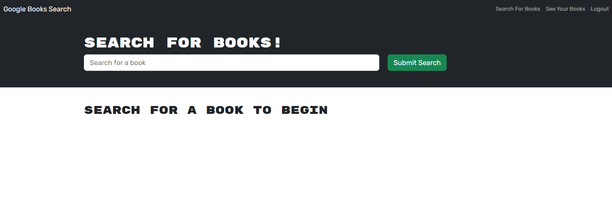
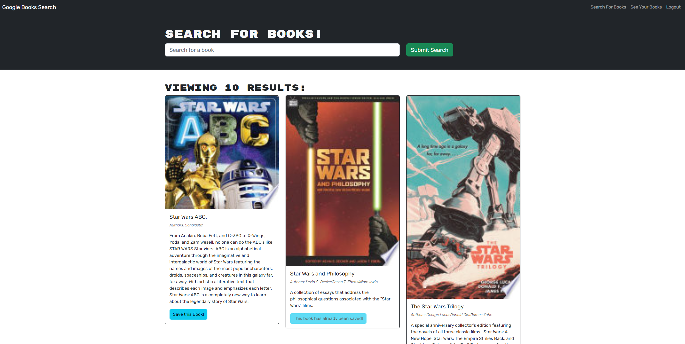
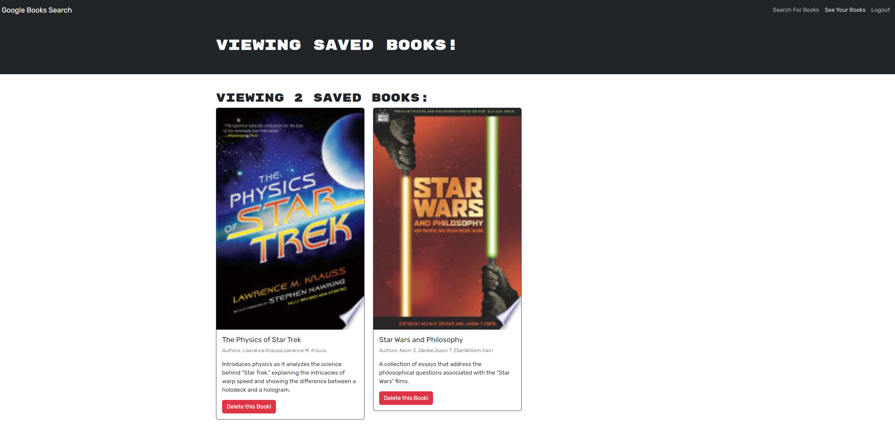

# Book Search Engine (MERN)

## Task

The task for this project is to refactor fully functioning Google Books API search engine built with a RESTful API to be a GraphQL API built with Apollo Server. The app was built using the MERN stack with a React front end, MongoDB database, and Node.js/Express.js server and API. It is an app set up to allow users to save book searches to the back end. 

## User Story

```md
AS AN avid reader
I WANT to search for new books to read
SO THAT I can keep a list of books to purchase
```

## Acceptance Criteria

```md
GIVEN a book search engine
WHEN I load the search engine
THEN I am presented with a menu with the options Search for Books and Login/Signup and an input field to search for books and a submit button
WHEN I click on the Search for Books menu option
THEN I am presented with an input field to search for books and a submit button
WHEN I am not logged in and enter a search term in the input field and click the submit button
THEN I am presented with several search results, each featuring a book’s title, author, description, image, and a link to that book on the Google Books site
WHEN I click on the Login/Signup menu option
THEN a modal appears on the screen with a toggle between the option to log in or sign up
WHEN the toggle is set to Signup
THEN I am presented with three inputs for a username, an email address, and a password, and a signup button
WHEN the toggle is set to Login
THEN I am presented with two inputs for an email address and a password and login button
WHEN I enter a valid email address and create a password and click on the signup button
THEN my user account is created and I am logged in to the site
WHEN I enter my account’s email address and password and click on the login button
THEN I the modal closes and I am logged in to the site
WHEN I am logged in to the site
THEN the menu options change to Search for Books, an option to see my saved books, and Logout
WHEN I am logged in and enter a search term in the input field and click the submit button
THEN I am presented with several search results, each featuring a book’s title, author, description, image, and a link to that book on the Google Books site and a button to save a book to my account
WHEN I click on the Save button on a book
THEN that book’s information is saved to my account
WHEN I click on the option to see my saved books
THEN I am presented with all of the books I have saved to my account, each featuring the book’s title, author, description, image, and a link to that book on the Google Books site and a button to remove a book from my account
WHEN I click on the Remove button on a book
THEN that book is deleted from my saved books list
WHEN I click on the Logout button
THEN I am logged out of the site and presented with a menu with the options Search for Books and Login/Signup and an input field to search for books and a submit button  
```

## Description 

* [Link to Deployed Application](https://protected-fjord-15586.herokuapp.com)

* How to Use
	 
	 
	* User can use Google book search engine with or without being logged in but the user needs to logged in to use 'saved this book' function.
	 
	* Search for the book and the user can save searched book information to their account.
	
	* User can see their saved book(s) at 'See Your Books' section/tab. They can also delete the saved book(s) from their saved list.


### Back-End Specifications

* `auth.js`: Update the auth middleware function to work with the GraphQL API.

* `server.js`: Implement the Apollo Server and apply it to the Express server as middleware.

* `Schemas` directory:

	* `index.js`: Export typeDefs and resolvers.

	* `resolvers.js`: Define the query and mutation functionality to work with the Mongoose models.

	* `typeDefs.js`: Define the necessary `Query` and `Mutation` types:

		* `Query` type:

			* `me`: Which returns a `User` type.
		
		* `Mutation` type:

			* `login`: Accepts an email and password as parameters; returns an `Auth` type.

			* `addUser`: Accepts a username, email, and password as parameters; returns an `Auth` type.

			* `saveBook`: Accepts a book author's array, description, title, bookId, image, and link as parameters; returns a `User` type.

			* `removeBook`: Accepts a book's `bookId` as a parameter; returns a `User` type.
			
		* `User` type:

			* `_id`

			* `username`

			* `email`

			* `bookCount`

			* `savedBooks` (This will be an array of the `Book` type.)

		* `Book` type:

			* `bookId` (Not the `_id`, but the book's `id` value returned from Google's Book API.)

			* `authors` (An array of strings, as there may be more than one author.)

			* `description`

			* `title`

			* `image`

			* `link`

		* `Auth` type:

			* `token`

			* `user` (References the `User` type.)


### Front-End Specifications

* `queries.js`: Holds the query `GET_ME`, which will execute the `me` query set up using Apollo Server.

* `mutations.js`:

	* `LOGIN_USER` executes the `loginUser` mutation set up using Apollo Server.

	* `ADD_USER` executes the `addUser` mutation.

	* `SAVE_BOOK` executes the `saveBook` mutation.

	* `REMOVE_BOOK` executes the `removeBook` mutation.

* `App.js`: Create an Apollo Provider to make every request work with the Apollo Server.
	
* `SearchBooks.js`:

	* Use the Apollo `useMutation()` Hook to execute the `SAVE_BOOK` mutation in the `handleSaveBook()` function.

* `SavedBooks.js`:

	* Use the `useQuery()` Hook to execute the `GET_ME` query on load and save it to a variable named `userData`.

	* Use the `useMutation()` Hook to execute the `REMOVE_BOOK` mutation in the `handleDeleteBook()` function.

* `SignupForm.js`: Use the `ADD_USER` mutation functionality.

* `LoginForm.js`: Use the `LOGIN_USER` mutation functionality.


## Credits

* How to use 'input' for typeDefs: https://stackoverflow.com/questions/41743253/whats-the-point-of-input-type-in-graphql
* Fixing GET/ error when Heroku deployed app is refreshed: https://stackoverflow.com/questions/51011397/cannot-get-page-after-page-reload-in-mean-stack-app


---
© 2023 edX Boot Camps LLC. Confidential and Proprietary. All Rights Reserved.
